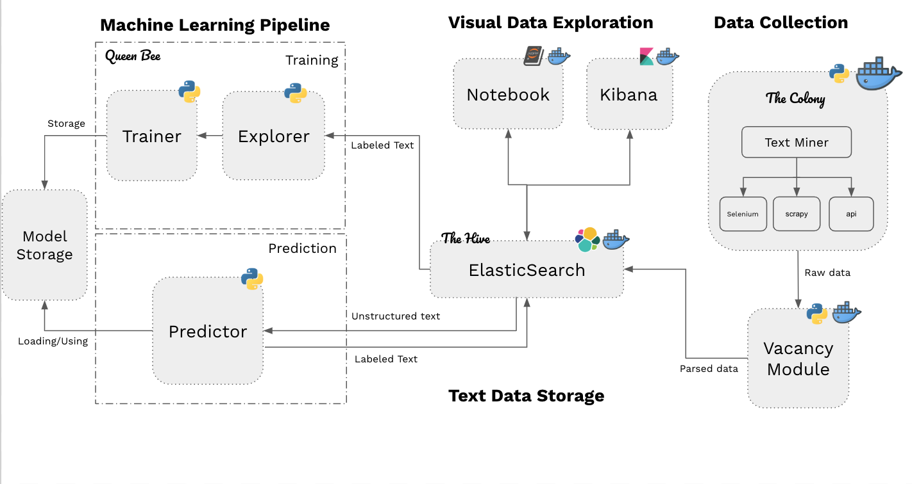

<h1 align="center">
  
</h1>
<h2 align="center">
</h2>

### Overview

### Infra & Services

### Resources
##### Python modules:
`joblib` , 
`matplotlib`,
`numpy`,
`pandas`,
`requests`,
`requests`,
`scikit`,
`seaborn`,
`nltk`,
`fasttext`,
`elasticsearch`,
`xmltodict`,

##### Other:
1. Notebook: https://jupyter-docker-stacks.readthedocs.io/en/latest/index.html
2. Elastic: https://www.elastic.co/products/elastic-stack

### Containers:
| name of container         | needed for |
| ------------------      | ----------     |
| `elasticsearch`   | indexing vacancy data (`localhost:9200`)|
| `kibana` | Dashboard for metrics on the vacancy data (`localhost:5601`) |
| `scipy-notebook`  | notebook with scipy tools and access to the ML pipeline modules (`localhost:8888`) |

### Data Collection:
 [project Monarch](https://github.com/Yaleesa/project-Monarch)

### Requirements & Setup

1. Docker
2. `pip install requirements.txt`

